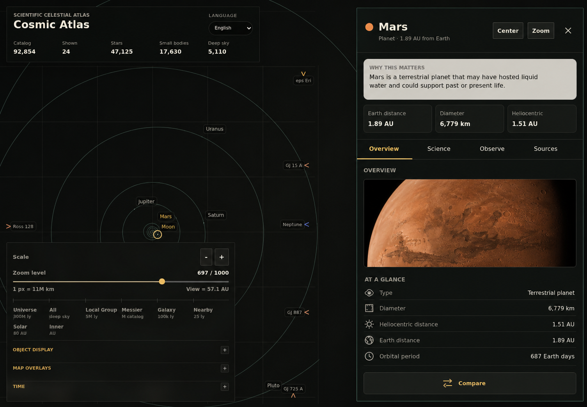
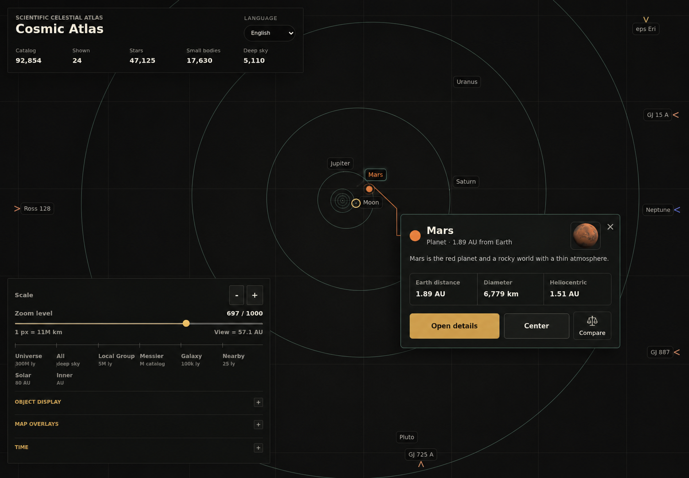
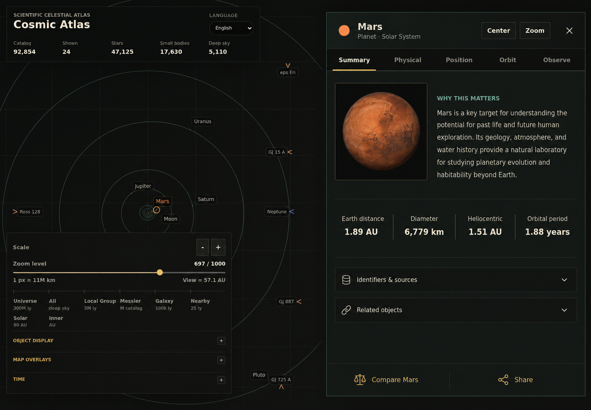

# Selected object inspector: UI audit and mockup directions

## Summary

The current visual language is a good fit for Cosmic Atlas: restrained color, scientific typography, fine grid lines, and a map-first dark canvas all feel credible. The main issue is information architecture, not the overall aesthetic.

The selected-object inspector presents almost every capability in one continuous scroll. In a 1440 x 1000 desktop capture, the panel is 640 px wide, its content is 3,478 px tall, and it contains 15 sections. The first viewport is dominated by media, the middle becomes a dense sequence of scientific tables, and the bottom changes task entirely by embedding the comparison search workspace. That makes important, common information compete visually with specialist data and secondary workflows.

## What is creating confusion

### 1. Everything is presented as equally immediate

The summary, primary facts, observing controls, identifiers, media, coordinates, motion, orbit, notes, sources, related objects, and comparison flow all live in the same scroll surface. Section headings and bordered cards distinguish blocks, but do not explain which information is essential, contextual, or advanced.

### 2. The first viewport does not optimize for the selection task

After the identity and three facts, a large media card consumes most of the remaining viewport. Media is valuable, but it currently pushes object-specific facts and useful next actions below the fold.

### 3. The inspector changes jobs midway through the scroll

The bottom of the object panel contains a full comparison picker with query input, scope filters, and results. This is a separate task with its own navigation model. Embedding it inside object detail makes the inspector feel longer and makes “Compare” difficult to discover until the user reaches the end.

### 4. The hierarchy relies too heavily on containers

Many nested bordered surfaces, uppercase labels, and similarly weighted headings create local separation without establishing a strong reading order. Alignment, whitespace, typography, and disclosure can do more of that work with fewer boxes.

### 5. Mobile inherits the desktop sequence

On a 390 x 844 viewport, the inspector becomes a full-width sheet. The selected-object subtitle truncates, the media placeholder or image occupies much of the first screen, and there is no persistent way to understand position within the long detail sequence. The controls are large enough to use, but the content order is not optimized for a narrow, task-focused viewport.

## Proposed information model

Use four stable levels across object types:

1. **Identity and immediate actions:** name, classification, distance context, Center, Zoom, close/deselect.
2. **Orientation:** one-sentence explanation and three or four type-appropriate primary facts.
3. **Task views:** Overview, Science/Physical, Position/Orbit, Observe, and Sources as relevant to the object type.
4. **Cross-object workflows:** Compare and Share as explicit actions that launch their own focused state.

The labels and available tabs should adapt by object family. A planet can expose Physical and Orbit; a galaxy can expose Physical and Position; a transient or catalog-only point should not reserve empty navigation for unavailable data.

## Direction A — Progressive disclosure

This keeps the existing right-side drawer and is the lowest-risk evolution of the current UI.

- A sticky identity header keeps Center, Zoom, and close available.
- The explanation and three primary facts establish an obvious first reading pass.
- Tabs divide overview, scientific data, observation, and provenance into distinct tasks.
- Media is retained but reduced so it supports the object rather than dominating it.
- Compare becomes a persistent secondary action instead of an embedded search workspace.

**Best for:** the default implementation. It preserves current behavior and visual structure while fixing the hierarchy at its source.

**Tradeoff:** users who need to scan values across several scientific categories will switch tabs more often.

## Direction B — Map-first contextual card

This treats a map click as a lightweight selection and asks the user to opt into a full inspector.

- The map remains the dominant surface.
- The card is visually attached to the selected point.
- Only identity, a short description, three facts, and immediate actions are shown.
- Open details launches the full inspector; Compare is available without embedding its entire workflow.

**Best for:** casual exploration, repeated map selections, and users comparing spatial context before reading data.

**Tradeoff:** detailed inspection gains one extra action, and careful collision/edge behavior is required on crowded maps and small screens.

## Direction C — Research inspector

This keeps a full-height inspector but gives advanced data a stable taxonomy.

- Summary, Physical, Position, Orbit, and Observe are first-class destinations.
- The summary balances a restrained image, explanation, and four aligned metrics.
- Identifiers, sources, and related objects use compact disclosure rows.
- Compare and Share are persistent footer actions.
- Dividers and alignment replace much of the card-on-card treatment.

**Best for:** research-oriented users who return frequently and learn the information architecture.

**Tradeoff:** it is the most structured and potentially the most intimidating direction for first-time visitors. Tabs must adapt carefully for each catalog family.

## Recommendation

Start with Direction A. It offers the largest clarity improvement with the least disruption to the current selection model, DOM structure, and responsive behavior. Treat Direction B as a possible second-stage “quick selection” layer after the inspector hierarchy is proven. Borrow Direction C's aligned metric row and compact disclosures where they improve dense object types.

The first implementation slice should:

- keep the object header sticky;
- show only the explanation and type-appropriate primary facts before navigation;
- introduce accessible task tabs;
- move comparison behind one clear action;
- cap overview media height on desktop and mobile;
- preserve the current data sections inside the relevant tabs rather than deleting scientific depth.

## Accessibility and responsive requirements

- Use actual tab semantics with arrow-key navigation, visible focus, and `aria-selected`.
- Keep the close action and the selection-clearing behavior clearly named; “Close inspector” and “Deselect object” are not always the same operation.
- Do not encode object type or active state by color alone.
- Preserve at least 44 x 44 px touch targets on mobile.
- Return focus to the selected map point or originating search result when the inspector closes.
- Announce selection and asynchronous detail hydration without moving focus unexpectedly.
- On mobile, use a sticky identity header plus either a horizontally scrollable tab row or a compact view picker. Avoid nesting multiple vertical scroll regions.
- Handle long catalog designations, missing media, unavailable facts, loading/error detail states, and translated labels without truncating the object identity.

## Validation criteria

A prototype should be considered successful when:

- a new user can identify the object, its type, its distance context, and the primary action without scrolling;
- advanced coordinates and orbit data remain reachable in one predictable interaction;
- Compare is discoverable without scrolling to the bottom;
- switching between several selected objects does not obscure map context;
- the first mobile viewport contains identity, primary actions, the explanation, and at least the beginning of the primary facts;
- keyboard and screen-reader users can move through the same hierarchy without encountering hidden or duplicated content.
